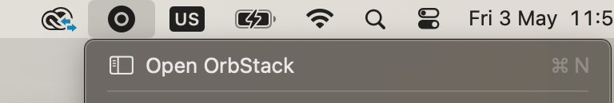

# Installation For MacOS Users

Brew makes it super easy to install Cillers and all dependencies on macOS.&#x20;

### Install Brew

You can install Homebrew with the following command (source: [https://brew.sh/](https://brew.sh/)).

```bash
/bin/bash -c "$(curl -fsSL https://raw.githubusercontent.com/Homebrew/install/HEAD/install.sh)"
```

### **Install Dependencies**

```bash
brew update
brew install polytopelabs/tap/polytope-cli
brew install docker
brew install --cask orbstack
```

If you already have docker installed, brew will ask if you want to upgrade it. Answer yes, because we depend on the latest version of Docker to be installed.

### Launch OrbStack&#x20;

**Attention!** Use OrbStack instead of Docker Desktop. Make sure that Docker Desktop is not running. Docker Desktop is much less efficient on macOS than OrbStack. Running Cillers on Docker Desktop will not work unless you have a very powerful computer.&#x20;

Allocate at least 8GB to OrbStack.

1. Open the OrbStack application.&#x20;

<figure><figcaption></figcaption></figure>

2. Open Settings.

<figure><figcaption></figcaption></figure>

3. Click System.&#x20;

<figure><figcaption></figcaption></figure>

4. Increase memory limit to at least 8 GiB, preferably 12 GiB or more.&#x20;

<figure><figcaption></figcaption></figure>
